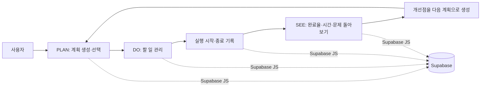
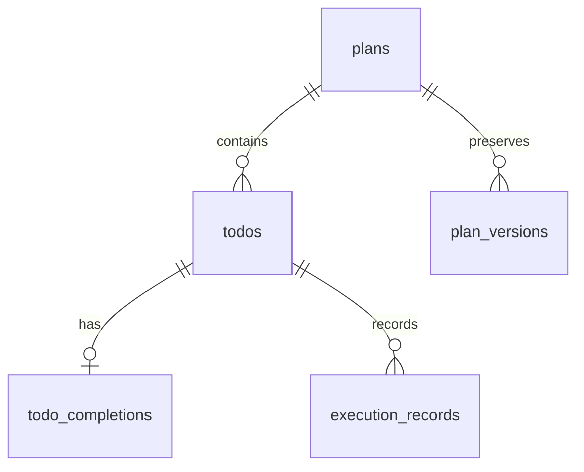

# PlanDoSee Diary

`PLAN → DO → SEE` 사이클로 계획을 세우고, 계획에 속한 할 일을 실행한 뒤 예상 시간과 실제 기록을 돌아보는 React 웹 애플리케이션입니다. 계획·할 일·실행 기록을 Supabase에 저장하고, 다음 계획에 개선점을 이어갈 수 있습니다.

> 로그인 없이 사용하는 공개형 작업 공간입니다. 공유해도 괜찮은 내용만 입력하세요.

## 주요 기능

| 영역 | 기능 | 구현 근거 |
| --- | --- | --- |
| PLAN | 월간 캘린더에서 계획 기간과 선택 날짜 확인 | `src/App.jsx` |
| PLAN | 계획 생성·수정·삭제, 우선순위·기간·성공 기준·예상 시간 입력 | `src/App.jsx` |
| PLAN | 계획 수정 전 상태를 버전 이력으로 조회 | `plan_versions`, `update_plan_with_history` |
| PLAN | 선택 날짜의 계획을 선택해 DO/SEE 대상 계획 변경 | `src/App.jsx` |
| PLAN | 전체 데이터를 `pds-diary-export-v1` JSON으로 브라우저 다운로드 | `src/App.jsx` |
| DO | 계획별 할 일 생성·수정·삭제 | `src/components/TodoSection.jsx` |
| DO | 마감일·우선순위·태그·예상 시간 관리 | `src/components/TodoSection.jsx` |
| DO | 완료/진행 중 상태 전환 및 완료 시각 저장 | `todos`, `todo_completions` |
| DO | 제목·태그 검색, 상태·우선순위·태그 필터, 마감일·우선순위·생성일 정렬 | `src/components/TodoSection.jsx` |
| DO | 실행 시작·종료 시각과 실제 소요 시간 저장 | `execution_records` |
| DO | 실행 중 막힌 이유 기록 및 최근 실행 요약 표시 | `src/components/TodoSection.jsx` |
| SEE | 전체·완료·지연·막힘 할 일 수와 완료율 표시 | `src/components/ReviewSection.jsx` |
| SEE | 예상 시간, 실제 실행 시간, 시간 차이(`실제 - 예상`) 비교 | `src/components/ReviewSection.jsx` |
| SEE | 집계 카드 클릭으로 해당 집계에 포함된 할 일 근거 확인 | `src/components/ReviewSection.jsx` |
| SEE | 할 일별 예상/실제 시간, 최근 실행, 막힌 이유 확인 | `src/components/ReviewSection.jsx` |
| SEE | 개선점을 입력해 종료일 다음 날의 `· 개선` 계획 생성 | `src/components/ReviewSection.jsx` |

## 기술 스택

| 구분 | 기술 | 사용 위치 및 목적 |
| --- | --- | --- |
| Frontend | React `19.2.8` | `src/App.jsx`, `src/components/` |
| Build | Vite `8.2.2` | `vite.config.js`, `package.json` |
| Backend/Data | Supabase JavaScript client `@supabase/supabase-js` | `src/lib/supabase.js` 및 각 컴포넌트의 테이블 조회/변경 |
| Language | JavaScript + JSX | `src/` |
| Lint | Oxlint `1.79.0` | `npm run lint` |

## 동작 흐름



주요 사용자 흐름은 다음과 같습니다.

1. PLAN에서 계획명, 기간, 우선순위, 성공 기준, 예상 시간을 입력합니다.
2. 캘린더의 날짜 또는 계획 카드를 선택하면 해당 계획이 DO/SEE의 대상이 됩니다.
3. DO에서 할 일을 만들고, 필요하면 실행 기록 패널에서 시작·종료 시각과 막힌 이유를 저장합니다.
4. SEE에서 완료율과 예상/실제 시간을 확인하고, 집계 카드를 클릭해 근거 할 일을 봅니다.
5. 개선점을 입력하면 현재 계획의 종료일 다음 날에 성공 기준으로 사용되는 새 계획이 생성됩니다.

## 데이터 구조

저장소의 [`contracts/pds-schema-v2.json`](contracts/pds-schema-v2.json)은 다음 데이터 구조와 관계를 정의합니다.

| 테이블 | 역할 | 주요 관계 |
| --- | --- | --- |
| `plans` | 사용자가 세운 계획 | `plans.id` → `todos.plan_id`, `plan_versions.plan_id` |
| `todos` | 계획에 속한 할 일 | `todos.id` → `todo_completions.todo_id`, `execution_records.todo_id` |
| `todo_completions` | 할 일의 완료 기록 | 할 일 하나당 `todo_id` 기준 최대 한 건 |
| `execution_records` | 실제 수행 작업 기록 | 하나의 할 일에 여러 실행 기록 가능 |
| `plan_versions` | 계획 수정 전 상태 보존 | 하나의 계획에 여러 버전 가능 |

날짜 전용 필드는 계획·할 일·버전 데이터에서 `YYYY-MM-DD`로 사용합니다. 돌아보기의 지연 계산은 `Asia/Seoul` 기준으로 미완료이고 마감일이 오늘보다 이전인 할 일만 대상으로 하며, 완료된 할 일은 지연에 포함하지 않습니다.



### Supabase 사용 범위

브라우저는 Supabase JavaScript client를 사용해 데이터베이스를 직접 조회하고 변경합니다.

- `plans`: 조회, 생성, 삭제, 수정 RPC 호출
- `todos`: 계획별 조회, 생성, 수정, 삭제, 상태 변경
- `todo_completions`: 완료 처리 시 upsert, 되돌리기/삭제 시 delete
- `execution_records`: 실행 시작 시 insert, 종료 시 update, 할 일 삭제 시 delete
- `plan_versions`: 수정 이력 조회
- RPC: `update_plan_with_history`가 수정 시점의 `updated_at`과 `change_key`를 전달받아 계획 수정과 이력 보존을 처리하도록 호출됨

## 설치 및 실행

### 사전 요구사항

- Node.js와 npm
- Supabase 프로젝트 및 아래 환경 변수

저장소에는 Node.js 버전 파일과 `.env.example`이 없으므로, 정확한 런타임 버전과 환경 변수 값은 사용하는 Supabase 프로젝트에 맞춰 준비해야 합니다.

### 설치

```bash
npm ci
```

### 환경 변수 설정

프로젝트 루트에 `.env` 파일을 만들고 다음 값을 설정합니다. `.env`는 `.gitignore`에 포함되어 있습니다.

```env
VITE_SUPABASE_URL=<your-supabase-project-url>
VITE_SUPABASE_PUBLISHABLE_KEY=<your-supabase-publishable-key>
```

두 변수는 `src/lib/supabase.js`에서 `import.meta.env`로 읽어 `createClient`에 전달됩니다. 실제 키나 토큰을 저장소와 README에 기록하지 마세요.

### 개발 서버

```bash
npm run dev
```

실행 후 Vite가 터미널에 출력한 로컬 주소를 브라우저에서 엽니다. 포트는 실행 환경에서 표시되는 값을 사용하세요.

### 프로덕션 빌드 및 미리보기

```bash
npm run build
npm run preview
```

## 품질 확인

코드 품질과 프로덕션 번들은 다음 명령으로 확인할 수 있습니다.

```bash
npm run lint
npm run build
```

## 프로젝트 구조

```text
.
├── contracts/
│   └── pds-schema-v2.json   # Plan → Do → See 데이터 구조 계약서
├── public/
│   ├── favicon.svg
│   └── icons.svg
├── src/
│   ├── components/
│   │   ├── ReviewSection.jsx
│   │   └── TodoSection.jsx
│   ├── assets/
│   │   ├── hero.png
│   │   ├── react.svg
│   │   └── vite.svg
│   ├── lib/
│   │   └── supabase.js
│   ├── App.jsx
│   ├── App.css
│   ├── index.css
│   └── main.jsx
├── index.html
├── package.json
├── package-lock.json
└── vite.config.js
```
