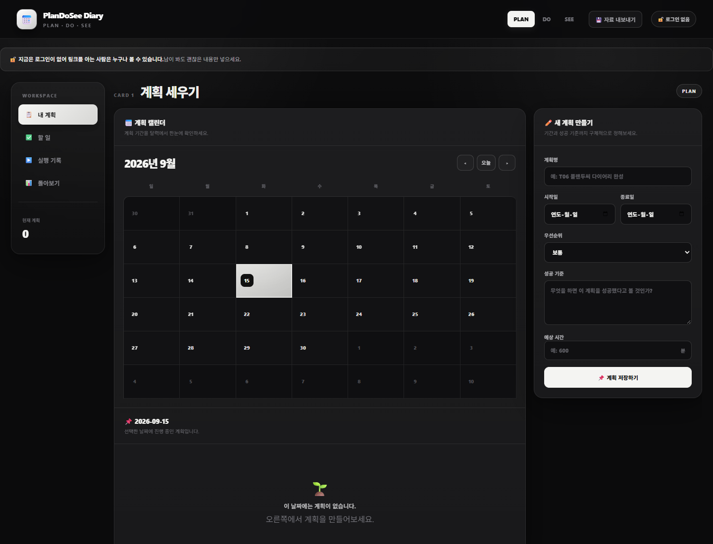
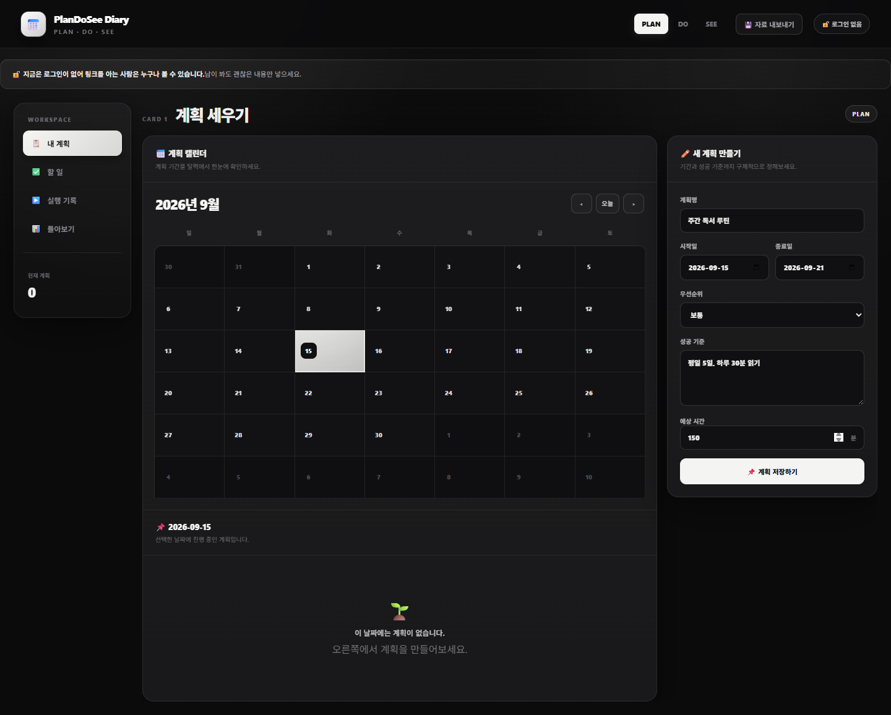
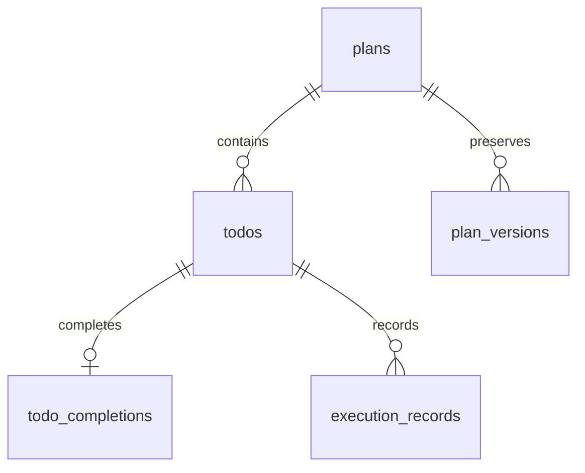

# PlanDoSee Diary

`PLAN → DO → SEE` 사이클을 한 화면에서 관리하는 React 웹 애플리케이션입니다. 계획과 실제 실행 사이의 차이를 기록하고, 돌아보기에서 얻은 개선점을 다음 계획으로 이어갈 수 있습니다.

## Demo

로컬 개발 서버에서 확인한 PLAN 화면입니다.





## 프로젝트 소개

PlanDoSee Diary는 계획 수립, 할 일 실행, 결과 회고를 하나의 흐름으로 연결합니다. 계획별 할 일과 실행 시간을 기록하고, 완료율과 예상·실제 시간을 비교해 다음 행동을 정리할 수 있습니다.

## 주요 기능

| 영역 | 기능 |
| --- | --- |
| PLAN | 월간 캘린더에서 계획 기간과 선택 날짜 확인 |
| PLAN | 계획 생성·수정·삭제, 우선순위·기간·성공 기준·예상 시간 입력 |
| PLAN | 계획 수정 전 상태를 버전 이력으로 보존하고 조회 |
| PLAN | 전체 계획·할 일·완료·실행·버전 데이터를 JSON으로 다운로드 |
| DO | 계획별 할 일 생성·수정·삭제 및 완료 상태 변경 |
| DO | 마감일·우선순위·태그·예상 시간 관리 |
| DO | 제목·태그 검색, 상태·우선순위·태그 필터, 정렬 |
| DO | 실행 시작·종료 시각과 실제 소요 시간 저장 |
| DO | 실행 중 막힌 이유 기록과 최근 실행 요약 표시 |
| SEE | 전체·완료·지연·막힘 할 일 수와 완료율 표시 |
| SEE | 예상 시간과 실제 실행 시간, 시간 차이 비교 |
| SEE | 집계 카드에 포함된 할 일 근거와 할 일별 실행 정보 확인 |
| SEE | 입력한 개선점을 종료일 다음 날의 새 계획으로 생성 |

## 기술 스택

| 구분 | 기술 | 사용 목적 |
| --- | --- | --- |
| Frontend | React `19.2.8`, React DOM | 화면 구성과 상태 관리 |
| Build | Vite `8.2.2` | 개발 서버와 프로덕션 번들 |
| Data | `@supabase/supabase-js` `2.112.4` | 테이블 조회·변경 및 RPC 호출 |
| Language | JavaScript + JSX | 애플리케이션 소스 |
| Lint | Oxlint `1.79.0` | 정적 코드 검사 |

## 시스템 구조


브라우저에서 실행되는 React 컴포넌트가 Supabase JavaScript client를 통해 계획, 할 일, 완료 기록, 실행 기록, 수정 이력을 읽고 저장합니다.

## 주요 동작 흐름

1. PLAN에서 계획명, 기간, 우선순위, 성공 기준, 예상 시간을 입력합니다.
2. 캘린더의 날짜 또는 계획 카드를 선택해 작업 대상을 정합니다.
3. DO에서 할 일을 추가하고 마감일, 태그, 예상 시간을 관리합니다.
4. 실행 기록에서 시작·종료 시각과 막힌 이유를 저장합니다.
5. SEE에서 완료율과 예상·실제 시간을 비교하고 집계 근거를 확인합니다.
6. 개선점을 입력하면 현재 계획의 종료일 다음 날에 새 계획이 생성됩니다.

## 프로젝트 구조

```text
.
├── contracts/
│   └── pds-schema-v2.json   # Plan → Do → See 데이터 구조 계약서
├── public/
│   ├── favicon.svg
│   └── icons.svg
├── docs/
│   └── assets/readme/        # README에 사용하는 실제 실행 화면 캡처
├── src/
│   ├── components/
│   │   ├── ReviewSection.jsx
│   │   └── TodoSection.jsx
│   ├── assets/
│   │   ├── hero.png
│   │   ├── react.svg
│   │   └── vite.svg
│   ├── lib/
│   │   └── supabase.js
│   ├── App.jsx
│   ├── App.css
│   ├── index.css
│   └── main.jsx
├── index.html
├── package.json
├── package-lock.json
└── vite.config.js
```

## 시작하기

### 사전 요구사항

- Node.js와 npm
- Supabase 프로젝트
- 아래 환경 변수 2개

### 설치 및 실행

```bash
git clone https://github.com/Gilin03/pds-diary.git
cd pds-diary
npm ci
npm run dev
```

Vite가 터미널에 출력한 로컬 주소를 브라우저에서 엽니다.

프로덕션 빌드와 미리보기는 다음 명령으로 실행합니다.

```bash
npm run build
npm run preview
```

## 환경 변수

프로젝트 루트에 `.env` 파일을 만들고 다음 변수를 설정합니다. `.env`와 `.env.local`은 저장소에 커밋되지 않도록 `.gitignore`에 포함되어 있습니다.

| 변수명 | 용도 |
| --- | --- |
| `VITE_SUPABASE_URL` | Supabase 프로젝트 URL |
| `VITE_SUPABASE_PUBLISHABLE_KEY` | 브라우저용 Supabase publishable key |

```env
VITE_SUPABASE_URL=<your-supabase-project-url>
VITE_SUPABASE_PUBLISHABLE_KEY=<your-supabase-publishable-key>
```

두 변수는 `src/lib/supabase.js`에서 `import.meta.env`로 읽어 Supabase client를 생성하는 데 사용합니다.

## 사용 방법

### PLAN — 계획 세우기

계획명, 시작일, 종료일, 우선순위, 성공 기준, 예상 시간을 입력해 계획을 저장합니다. 캘린더에서 날짜를 선택하면 해당 날짜에 진행 중인 계획을 확인할 수 있습니다. 계획을 수정하면 수정 전 상태가 버전 이력에 남습니다.

### DO — 할 일과 실행 기록

선택한 계획에 할 일을 추가하고 마감일, 우선순위, 태그, 예상 시간을 입력합니다. 할 일을 완료 처리하거나 진행 중으로 되돌릴 수 있으며, 실행 기록에서 시작·종료 시각과 막힌 이유를 남길 수 있습니다.

### SEE — 돌아보기

완료율, 완료·지연·막힘 상태별 개수, 예상 시간과 실제 실행 시간을 확인합니다. 집계 카드와 할 일별 상세 내용을 통해 수치의 근거를 살펴보고, 개선점을 다음 계획의 성공 기준으로 넘길 수 있습니다.

상단의 `💾 자료 내보내기` 버튼을 사용하면 계획과 관련 기록을 `pds-diary-export-v1` 형식의 JSON 파일로 다운로드합니다.

## 데이터베이스 구조

데이터 구조의 기준은 [`contracts/pds-schema-v2.json`](contracts/pds-schema-v2.json)입니다.

| 테이블 | 주요 필드 | 역할 |
| --- | --- | --- |
| `plans` | `title`, `start_date`, `end_date`, `priority`, `success_criteria`, `estimated_minutes` | 사용자가 세운 계획 |
| `todos` | `plan_id`, `title`, `due_date`, `priority`, `tag`, `estimated_minutes`, `status` | 계획에 속한 할 일 |
| `todo_completions` | `todo_id`, `completed_at` | 할 일 완료 기록 |
| `execution_records` | `todo_id`, `started_at`, `ended_at`, `actual_minutes`, `blocked_reason` | 실제 수행 작업 기록 |
| `plan_versions` | `plan_id`, `version`, 계획 필드 사본 | 계획 수정 전 상태 보존 |



브라우저에서 사용하는 주요 Supabase 작업은 다음과 같습니다.

- `plans`: 조회, 생성, 삭제, 계획 수정 RPC 호출
- `todos`: 계획별 조회, 생성, 수정, 삭제, 상태 변경
- `todo_completions`: 완료 처리 시 upsert, 진행 중으로 되돌릴 때 삭제
- `execution_records`: 실행 시작 시 insert, 종료 시 update, 할 일 삭제 시 delete
- `plan_versions`: 계획 수정 이력 조회
- `update_plan_with_history`: 수정 전 계획을 이력으로 보존하고 현재 계획을 갱신하는 RPC

날짜 전용 필드는 `YYYY-MM-DD` 형식으로 사용하며, 지연 계산과 실행 시각 표시는 `Asia/Seoul` 기준을 사용합니다. 지연은 미완료 상태이고 마감일이 서울 시간 기준 오늘보다 이전인 할 일만 대상으로 합니다.

## 보안 및 권한

- 로그인 화면이나 세션 기반 인증 없이 사용하는 흐름이며, 앱 상단에 링크 공개 범위를 안내합니다.
- Supabase URL과 publishable key는 환경 변수로 주입하며, 실제 키·토큰·비밀번호는 저장소에 올리지 않습니다.
- 계획 입력은 계획명, 기간, 성공 기준, 예상 시간을 검증하고 종료일이 시작일보다 빠르지 않도록 합니다.
- 할 일 입력은 제목을 검증하고 예상 시간을 0 이상의 정수로 제한합니다.
- 실행 기록은 시작·종료 시각의 존재와 시간 순서를 검증하고 실제 시간은 두 시각의 차이로 계산합니다.
- 삭제 전 확인 창을 표시하며 Supabase 조회·저장 오류는 화면의 오류 메시지로 표시합니다.

## 테스트 및 검증

| 검증 항목 | 실행·확인 | 결과 |
| --- | --- | --- |
| 정적 검사 | `npm run lint` | 종료 코드 0, 경고 11건 확인 |
| 프로덕션 빌드 | `npm run build` | Vite 빌드 통과, 63개 모듈 변환 및 `dist/` 생성 |
| PLAN 화면 확인 | 로컬 개발 서버에서 실제 브라우저 렌더링 확인 | 캘린더와 계획 입력 폼 표시 확인 |

## 개발 중 해결한 문제

### 계획 수정과 수정 이력의 일관성

계획 수정 시 현재 계획 갱신과 수정 전 내용 보존을 브라우저의 여러 요청으로 나누지 않고 `update_plan_with_history` RPC 호출로 처리합니다. 수정 시작 시점의 `updated_at`을 함께 전달해 다른 수정이 먼저 완료된 경우를 구분하고, 화면에서는 동시에 실행 중인 수정 저장 요청을 막습니다.
