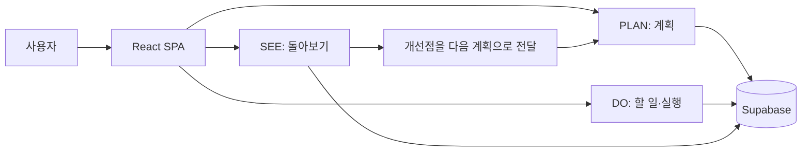
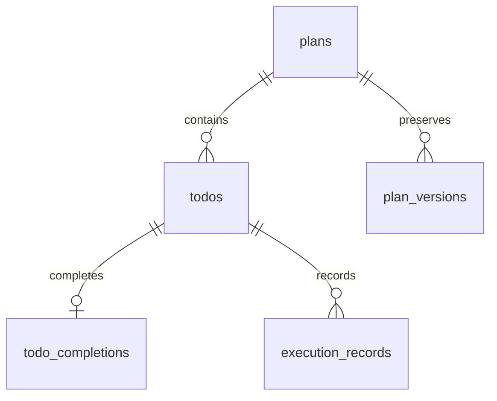

# PlanDoSee Diary — 계획·실행·회고 기록 서비스

> 계획을 세우고, 실행을 기록하고, 결과를 돌아보는 `PLAN → DO → SEE` 작업 관리 앱입니다.

PlanDoSee Diary는 계획과 실제 실행 사이의 차이를 기록하고, 돌아보기에서 얻은 개선점을 다음 계획으로 이어갈 수 있도록 구성했습니다.


<p align="center">
  <a href="https://github.com/Gilin03/plan-do-see-diary">GitHub Repository</a>
</p>

<p align="center">
  
  
  
</p>

## 목차

- [프로젝트 소개](#프로젝트-소개)
- [빠른 시작](#빠른-시작)
- [사용 방법](#사용-방법)
- [주요 기능](#주요-기능)
- [기술 스택](#기술-스택)
- [아키텍처](#아키텍처)
- [데이터베이스 구조](#데이터베이스-구조)
- [프로젝트 구조](#프로젝트-구조)
- [검증](#검증)
- [구현 포인트](#구현-포인트)

## 프로젝트 소개

### 프로젝트 목표

계획을 세우는 단계와 실제로 실행한 결과가 분리되면, 무엇이 잘 진행됐고 어디에서 막혔는지 확인하기 어렵습니다. 이 프로젝트는 계획, 할 일, 실행 기록, 회고를 하나의 흐름으로 연결해 다음 행동을 정리하는 것을 목표로 합니다.

사용자는 계획별 할 일과 실행 시간을 남기고, 완료율·지연·막힘 상태와 예상 시간·실제 시간을 비교할 수 있습니다. 회고에서 작성한 개선점은 종료일 다음 날의 새 계획으로 이어집니다.

## 빠른 시작

### 요구 사항

- Node.js와 npm
- Supabase 프로젝트
- `VITE_SUPABASE_URL`
- `VITE_SUPABASE_PUBLISHABLE_KEY`

### 설치 및 실행

```bash
git clone https://github.com/Gilin03/plan-do-see-diary.git
cd plan-do-see-diary
npm ci
npm run dev
```

Vite가 출력한 로컬 주소를 브라우저에서 엽니다.

### Production build 확인

```bash
npm run build
npm run preview
```

`npm run build`로 프로덕션 번들을 생성한 뒤 `npm run preview`로 결과를 확인할 수 있습니다.

## 사용 방법

### 기본 사용 흐름

1. PLAN에서 계획명, 시작일, 종료일, 우선순위, 성공 기준, 예상 시간을 입력합니다.
2. 캘린더 날짜 또는 계획 카드를 선택해 작업 대상을 정합니다.
3. DO에서 할 일을 추가하고 마감일, 태그, 우선순위, 예상 시간을 입력합니다.
4. 실행 기록에서 시작·종료 시각과 막힌 이유를 저장합니다.
5. SEE에서 완료율과 예상·실제 시간을 비교하고 집계 근거를 확인합니다.
6. 개선점을 입력해 현재 계획의 종료일 다음 날에 새 계획을 만듭니다.

### 옵션·권한·주의사항

- 로그인이나 세션 절차 없이 사용하는 작업 공간입니다.
- 앱 상단에 링크 공개 범위가 안내되므로 다른 사람이 봐도 괜찮은 내용만 입력해야 합니다.
- 상단의 `💾 자료 내보내기` 버튼으로 계획과 관련 기록을 `pds-diary-export-v1` 형식의 JSON 파일로 다운로드할 수 있습니다.

## 주요 기능

### PLAN — 계획 세우기

- 월간 캘린더에서 계획 기간과 선택 날짜를 확인합니다.
- 계획을 생성·수정·삭제하고 우선순위, 기간, 성공 기준, 예상 시간을 관리합니다.
- 계획 수정 전 상태를 버전 이력으로 보존하고 조회합니다.

### DO — 할 일과 실행 기록

- 계획별 할 일을 생성·수정·삭제하고 완료 상태를 변경합니다.
- 제목과 태그를 검색하고 상태·우선순위·태그로 필터링하거나 정렬합니다.
- 실행 시작·종료 시각, 실제 소요 시간, 막힌 이유를 저장합니다.

### SEE — 돌아보기

- 전체·완료·지연·막힘 할 일 수와 완료율을 확인합니다.
- 예상 시간과 실제 실행 시간, 시간 차이를 비교합니다.
- 집계 카드에 포함된 할 일 근거와 할 일별 실행 정보를 확인합니다.
- 개선점을 종료일 다음 날의 새 계획으로 생성합니다.

## 기술 스택

| 구분 | 기술 | 사용 목적 |
| --- | --- | --- |
| Frontend | React `19.2.8`, React DOM | 화면 구성과 상태 관리 |
| Build | Vite `8.2.2` | 개발 서버와 프로덕션 번들 |
| Data | `@supabase/supabase-js` `2.112.4` | 테이블 조회·변경 및 RPC 호출 |
| Language | JavaScript + JSX | 애플리케이션 소스 |
| Lint | Oxlint `1.79.0` | 정적 코드 검사 |

## 아키텍처



React 컴포넌트가 브라우저에서 동작하며 Supabase JavaScript client를 통해 계획, 할 일, 완료 기록, 실행 기록, 수정 이력을 읽고 저장합니다.

## 데이터베이스 구조

데이터 구조의 기준은 [`contracts/pds-schema-v2.json`](contracts/pds-schema-v2.json)입니다.

| 테이블 | 주요 필드 | 역할 |
| --- | --- | --- |
| `plans` | `title`, `start_date`, `end_date`, `priority`, `success_criteria`, `estimated_minutes` | 사용자가 세운 계획 |
| `todos` | `plan_id`, `title`, `due_date`, `priority`, `tag`, `estimated_minutes`, `status` | 계획에 속한 할 일 |
| `todo_completions` | `todo_id`, `completed_at` | 할 일 완료 기록 |
| `execution_records` | `todo_id`, `started_at`, `ended_at`, `actual_minutes`, `blocked_reason` | 실제 수행 작업 기록 |
| `plan_versions` | `plan_id`, `version`, 계획 필드 사본 | 계획 수정 전 상태 보존 |



주요 데이터 작업은 다음과 같습니다.

- `plans`: 조회, 생성, 삭제, 계획 수정 RPC 호출
- `todos`: 계획별 조회, 생성, 수정, 삭제, 상태 변경
- `todo_completions`: 완료 처리 시 upsert, 진행 중으로 되돌릴 때 삭제
- `execution_records`: 실행 시작 시 insert, 종료 시 update, 할 일 삭제 시 delete
- `plan_versions`: 계획 수정 이력 조회
- `update_plan_with_history`: 수정 전 계획을 이력으로 보존하고 현재 계획을 갱신하는 RPC

날짜 전용 필드는 `YYYY-MM-DD` 형식으로 사용하며, 지연 계산과 실행 시각 표시는 `Asia/Seoul` 기준을 사용합니다. 지연은 미완료 상태이고 마감일이 서울 시간 기준 오늘보다 이전인 할 일만 대상으로 합니다.

## 프로젝트 구조

```text
.
├── contracts/
│   └── pds-schema-v2.json   # Plan → Do → See 데이터 구조 계약서
├── docs/
│   └── images/
│       └── overview.png     # README 상단 대표 화면
├── public/
│   ├── favicon.svg
│   └── icons.svg
├── src/
│   ├── components/
│   │   ├── ReviewSection.jsx
│   │   └── TodoSection.jsx
│   ├── assets/
│   │   ├── hero.png
│   │   ├── react.svg
│   │   └── vite.svg
│   ├── lib/
│   │   └── supabase.js
│   ├── App.jsx
│   ├── App.css
│   ├── index.css
│   └── main.jsx
├── index.html
├── package.json
├── package-lock.json
└── vite.config.js
```

## 검증

### 명령어 검증

| 구분 | 항목 | 명령 | 결과 |
| --- | --- | --- | --- |
| 자동 | 린트 | `npm run lint` | 종료 코드 0, 경고 11건 확인 |
| 자동 | 프로덕션 빌드 | `npm run build` | Vite 빌드 통과, 63개 모듈 변환 |

### 수동 확인 시나리오

| 항목 | 절차 | 결과 |
| --- | --- | --- |
| PLAN 첫 화면 | 로컬 개발 서버 접속 후 캘린더와 계획 입력 폼 확인 | 화면 렌더링 확인 |
| 대표 이미지 | 실제 브라우저 화면을 `docs/images/overview.png`로 캡처 | 캡처 파일 확인 |

## 구현 포인트

### 계획 수정과 수정 이력의 일관성

계획 수정 시 현재 계획 갱신과 수정 전 내용 보존을 브라우저의 여러 요청으로 나누지 않고 `update_plan_with_history` RPC 호출로 처리합니다. 수정 시작 시점의 `updated_at`과 `change_key`를 함께 전달해 다른 수정이 먼저 완료된 경우와 중복 저장을 구분하고, 화면에서는 동시에 실행 중인 수정 저장 요청을 막습니다.

### 시간·날짜 기준 통일

날짜 전용 값은 `YYYY-MM-DD`로 처리하고, 지연 여부와 실행 시각은 `Asia/Seoul` 기준으로 계산합니다. 실행 기록의 실제 시간은 시작·종료 시각의 차이로 계산합니다.

### 기록 내보내기

계획, 할 일, 완료 기록, 실행 기록, 수정 이력을 한 번에 조회해 `pds-diary-export-v1` JSON 구조로 묶어 다운로드합니다.
